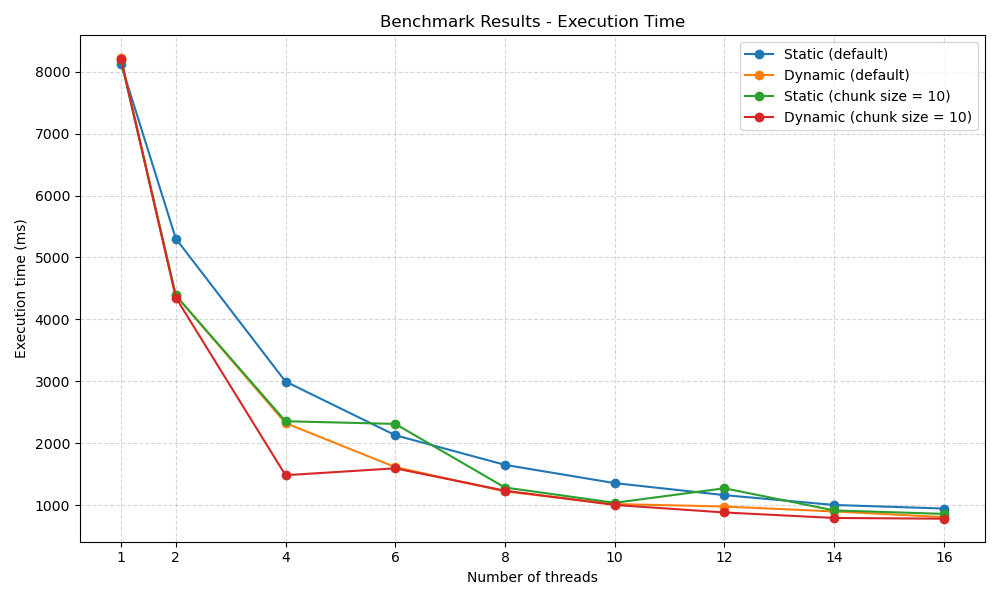
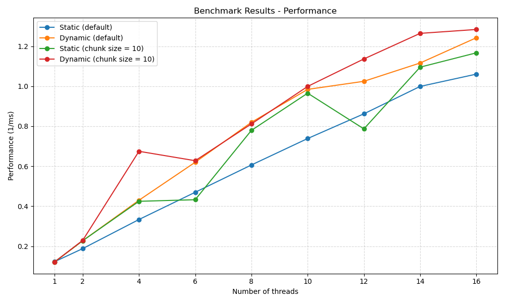

# Problem 1 Results

## Environment

| CPU Type | CPU Model | Number of Cores | CPU Frequency | RAM Size | OS |
|----------|-----------|-----------------|---------------|----------|----|
| AMD Razen | AMD Ryzen 7 5800H | 8 | 3.2 GHz | 16 GB | Windows 11 -> WSL2 -> Ubuntu 24.04.2 |

## Results

All the resuts diplay here are the average of 10 runs to find the number of prime numbers in the range of 1 to 200000.

For better understanding on how the code tests are runs, please refer to the [`utils/report.go`](utils/report.go) file.

All the times are in milliseconds.

For better clarity, the code to tests either or not a number is prime have been slowed down by a lot by doing useless extensive calculations :

```c
// Check if a number is prime with a slow calculation
int is_prime_slow(int num) {
    if (num < 2) return 0;
    int slow_count = 0;
    for (int i = 2; i * i <= num; i++) {
        // Intentionally slow calculation
        for (int j = 0; j < 100; j++) {
            slow_count += sqrt(i * j) / (j + 1);
        }
        if (num % i == 0) return 0;
    }
    return 1;
}
```

### Execution Time

| Scheduling Type | 1 | 2 | 4 | 6 | 8 | 10 | 12 | 14 | 16 |
|-----------------|----|----|----|----|----|----|----|----|----|
| Static (default) | 8132 | 5306 | 2996 | 2128 | 1649 | 1354 | 1160 | 1001 | 943 |
| Dynamic (default) | 8218 | 4389 | 2325 | 1613 | 1220 | 1016 | 976 | 896 | 805 |
| Static (chunk size = 10) | 8188 | 4387 | 2354 | 2311 | 1283 | 1036 | 1271 | 913 | 857 |
| Dynamic (chunk size = 10) | 8215 | 4353 | 1482 | 1593 | 1232 | 1001 | 880 | 791 | 779 |



### Performance

| Scheduling Type | 1 | 2 | 4 | 6 | 8 | 10 | 12 | 14 | 16 |
|-----------------|----|----|----|----|----|----|----|----|----|
| Static (default) | 0.123 | 0.188 | 0.334 | 0.470 | 0.606 | 0.739 | 0.862 | 0.999 | 1.060 |
| Dynamic (default) | 0.122 | 0.228 | 0.430 | 0.620 | 0.820 | 0.984 | 1.025 | 1.116 | 1.242 |
| Static (chunk size = 10) | 0.122 | 0.228 | 0.425 | 0.433 | 0.779 | 0.965 | 0.787 | 1.095 | 1.167 |
| Dynamic (chunk size = 10) | 0.122 | 0.230 | 0.675 | 0.628 | 0.812 | 0.999 | 1.136 | 1.264 | 1.284 |



## Results Analysis

The results clearly demonstrate the impact of thread scheduling strategies on parallel performance. Here are the key observations:
 - **Performance improves significantly with increased thread count**. Across all scheduling policies, execution time decreases and performance improves as the number of threads increases. This is expected, as more threads allow more numbers to be tested in parallel.
 - **Dynamic scheduling consistently outperforms static scheduling**. For both default and chunk-size-10 configurations, dynamic scheduling achieves lower execution times and higher performance compared to static scheduling. This is especially noticeable with higher thread counts, where load imbalance becomes more significant.
 - **Static scheduling suffers from load imbalance**. The static (default) configuration, which assigns continuous blocks of the number range to threads, performs poorly at high thread counts. This is due to uneven work distribution: smaller numbers (tested by the first threads) contain more primes and are faster to evaluate, while higher numbers are slower to process and less likely to be prime, causing threads to finish at different times and leave some cores idle.
 - **Dynamic scheduling with chunk size 10 offers the best overall performance**. The dynamic, chunk=10 configuration provides the best balance between parallelism and scheduling overhead. It achieves the lowest execution time and the highest performance at 16 threads, showing that breaking the work into smaller chunks helps distribute load more evenly across threads.
 - **Small chunk sizes help reduce idle time**. Comparing static (default) and static (chunk size = 10) shows that finer-grained static chunks perform better in some cases (e.g. at 8–10 threads), but still lag behind dynamic scheduling due to lack of runtime flexibility.

In summary, dynamic scheduling—especially with small chunk sizes—is the most effective approach for this type of computation where workload per iteration is highly variable and hard to predict. Static approaches are simpler but become inefficient as thread count increases due to poor load balancing.

## Tools

### Benchmarking

The benchmarking was done using a go script that runs the code 10 times and takes the average of the results. The script get the execution time by parsing the stdout of the C programme.

### Data Visualization

The data visualization is done using the Python libraries `matplotlib` to generate the graphs. The tables are generated using simple markdown tables.
The graphs are saved in the `media` directory, and the tables are included in this markdown file.

The script will read the `results.json` file generated by the go script and generate the graphs and tables based on the data in the file.

To generate the graphs and tables, run the following command:
```bash
python3 gen_report.py
```
This will display the table in the standart output and sage the png of the graph in the `media` directory.
