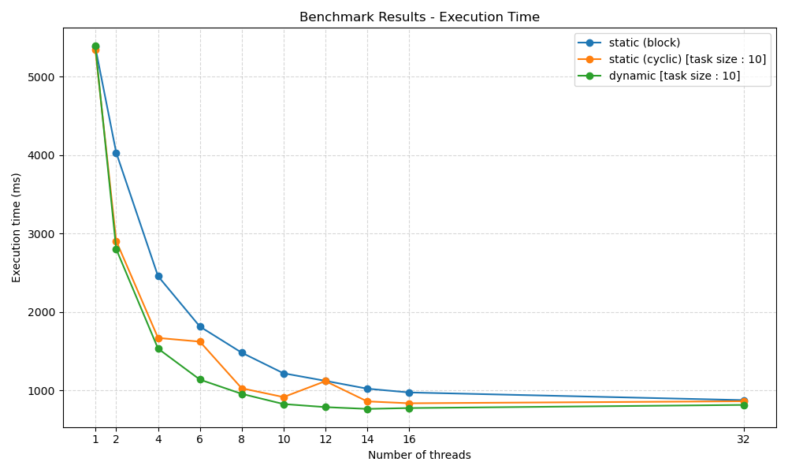
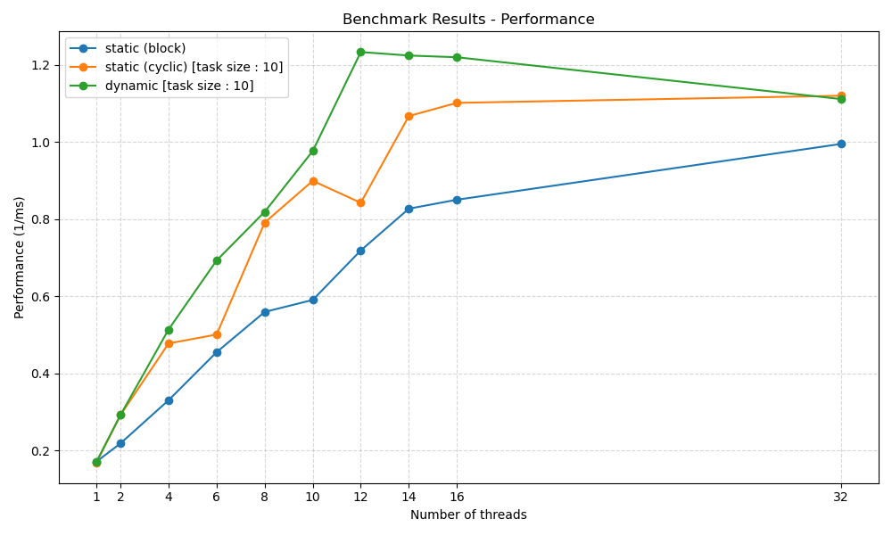

# Problem 1 Results

## Environment

| CPU Type | CPU Model | Number of Cores | CPU Frequency | RAM Size | OS | Runtime Environment |
|----------|-----------|-----------------|---------------|----------|----|---------------------|
| AMD Razen | AMD Ryzen 7 5800H | 8 | 3.2 GHz | 16 GB | Windows 11 -> WSL2 -> Ubuntu 24.04.2 | Docker openjdk:17-jdk-slim |

## Results

All the resuts diplay here are the average of 10 runs to find the number of prime numbers in the range of 1 to 200000.

For better understanding on how the code tests are runs, please refer to the [`src/BenchmarkRunner.java`](../src/BenchmarkRunner.java) file.

All the times are in milliseconds.

### Execution Time

pc_serial : 5117 ms

| Thread number | 1 | 2 | 4 | 6 | 8 | 10 | 12 | 14 | 16 | 32 |
|---------------|----|----|----|----|----|----|----|----|----|----|
| static (block) | 5381 | 4033 | 2457 | 1815 | 1482 | 1219 | 1123 | 1023 | 975 | 877 |
| static (cyclic) [task size : 10] | 5350 | 2907 | 1670 | 1623 | 1028 | 916 | 1119 | 861 | 837 | 863 |
| dynamic [task size : 10] | 5392 | 2803 | 1534 | 1139 | 957 | 827 | 788 | 765 | 776 | 816 |



### Performance

For better readability, the value for the performance is calculated using the execution time in seconds.

| Thread number | 1 | 2 | 4 | 6 | 8 | 10 | 12 | 14 | 16 | 32 |
|---------------|----|----|----|----|----|----|----|----|----|----|
| static (block) | 0.186 | 0.248 | 0.407 | 0.551 | 0.675 | 0.820 | 0.890 | 0.978 | 1.026 | 1.140 |
| static (cyclic) [task size : 10] | 0.187 | 0.344 | 0.599 | 0.616 | 0.973 | 1.092 | 0.894 | 1.161 | 1.195 | 1.159 |
| dynamic [task size : 10] | 0.185 | 0.357 | 0.652 | 0.878 | 1.045 | 1.209 | 1.269 | 1.307 | 1.289 | 1.225 |




## Results Analysis

The serial version (`pc_serial`) completes in approximately 5117 ms, which serves as the baseline for comparing the parallel implementations.

All parallel implementations outperform the serial version when multiple threads are used. Execution time generally decreases as the number of threads increases, although the rate of improvement diminishes past a certain point.

- The static (block) strategy shows consistent improvements, but scales less efficiently beyond 12 threads.
- The static (cyclic) and dynamic strategies achieve better scalability, particularly when using more than 8 threads.
- The dynamic scheduling consistently outperforms the other strategies at high thread counts (12–16 threads), likely due to better load balancing.

When visualized as performance, the dynamic strategy exhibits the best results overall, reaching over 1.2 (1/ms) at 12–16 threads.

- The static (cyclic) strategy closely follows, especially at 14–32 threads, indicating it also benefits from fine-grained task distribution.
- Static (block) performance grows steadily, but doesn't reach the same levels as the other two, likely due to load imbalance in uneven workloads.

At 32 threads, all strategies plateau or slightly drop in performance. This suggests the workload becomes too fragmented, or overheads such as synchronization and task dispatching begin to outweigh the benefits of additional threads — a common occurrence in CPU-bound tasks when the number of threads exceeds the number of physical cores.

- The static (block) strategy, while initially promising, shows diminishing returns at higher thread counts, indicating that its fixed-size task allocation may not be optimal for all scenarios.
- The static (cyclic) and dynamic strategies, while still effective, also show signs of diminishing returns, suggesting that the overhead of managing many threads can negate the benefits of parallelism.
- The dynamic strategy, while still the best performer, also shows signs of diminishing returns, suggesting that the overhead of managing many threads can negate the benefits of parallelism.

## Tools

### Docker

If you don't have Java installed on your machine, you can use the Docker image provided in the `Dockerfile` to run the code. The Docker image is based on `openjdk:17-jdk-slim`, which is a lightweight version of the OpenJDK 17 JDK.

to build and run the image, you can use the Makefile provided in the root directory of the project. The Makefile contains the following targets:
- `all`: call the run target.
- `build`: Builds the Docker image.
- `run`: Runs the Docker container and executes bash.

The image will provide a Java environment and a shell prompt where you can run the Java code.

### Benchmarking

The benchmarking is done using the BenchmarkRunner class, which is a simple Java program that runs the différents programme and compile the results on a json file.

### Data Visualization

The data visualization is done using the Python libraries `matplotlib` to generate the graphs. The tables are generated using simple markdown tables.
The graphs are saved in the `media` directory, and the tables are included in this markdown file.

The script will read the `results.json` file generated by the BenchmarkRunner class and generate the graphs and tables based on the data in the file.

To generate the execution time graph and table, run the following command:
```bash
python3 generate_tab.py
```
This will display the table in the standart output and sage the png of the graph in the `media` directory.

To generate the performance graph and table, run the following command:
```bash
python3 generate_tab.py --perf
```
The will display the table in the standart output and sage the png of the graph in the `media` directory.
