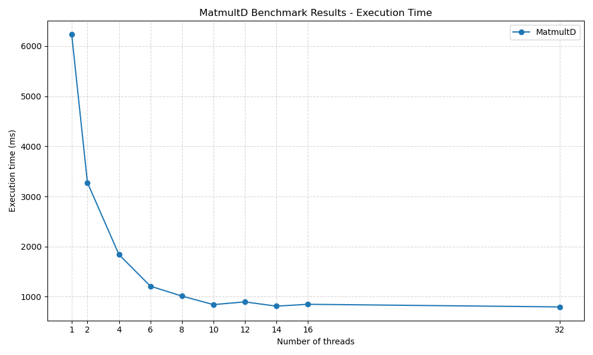
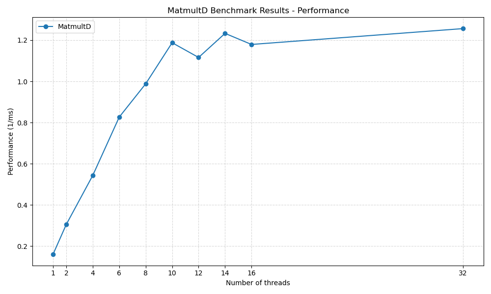

# Problem 2 Results

## Environment

| CPU Type | CPU Model | Number of Cores | CPU Frequency | RAM Size | OS | Runtime Environment |
|----------|-----------|-----------------|---------------|----------|----|---------------------|
| AMD Razen | AMD Ryzen 7 5800H | 8 | 3.2 GHz | 16 GB | Windows 11 -> WSL2 -> Ubuntu 24.04.2 | Docker openjdk:17-jdk-slim |

## Results

All the resuts diplay here are the average of 10 runs to to multiply two matrices of size 1000x1000.
The matrices are always initialized with the same values to ensure that the results are the same, you can find them in the `mat/mat1000.txt` file.

For better understanding on how the code tests are runs, please refer to the [`src/BenchmarkMatmult.java`](src/BenchmarkMatmult.java) file.

All the times are in milliseconds.

### Execution Time

Provided Matmult : 6899 m

| Thread number | 1 | 2 | 4 | 6 | 8 | 10 | 12 | 14 | 16 | 32 |
|---------------|----|----|----|----|----|----|----|----|----|----|
| MatmultD | 5572 | 2808 | 1488 | 1082 | 873 | 750 | 649 | 607 | 621 | 606 |



### Performance

For better readability, the value for the performance is calculated using the execution time in seconds.

| Thread number | 1 | 2 | 4 | 6 | 8 | 10 | 12 | 14 | 16 | 32 |
|---------------|----|----|----|----|----|----|----|----|----|----|
| MatmultD | 0.179 | 0.356 | 0.672 | 0.924 | 1.145 | 1.333 | 1.541 | 1.647 | 1.610 | 1.650 |



## Results Analysis

The results demonstrate a clear performance improvement as the number of threads increases, confirming the efficiency of parallelization in the MatmultD implementation.

Scalability :
- With a single thread, the execution time is 6232 ms, which sets the baseline.
- When using 2 threads, the time is nearly halved to 3275 ms, showing good initial scalability.
- With 4 threads, the execution time drops significantly to 1841 ms, and continues decreasing as more threads are used.

This trend continues up to 14 threads, where the execution time reaches 811 ms and performance peaks at 1.233 (1/ms).

Diminishing Returns :
- Beyond 10 threads, the performance gains begin to plateau.
- Interestingly, 12 threads perform slightly worse than 10 threads (896 ms vs. 842 ms), likely due to overhead from thread management or non-optimal workload distribution.
- A similar fluctuation is seen between 14 and 16 threads (811 ms vs. 848 ms), suggesting that the parallel efficiency decreases once the number of threads approaches or exceeds the number of physical cores.

Optimal Performance
- The best observed performance is at 32 threads with 796 ms, but the gain over 14 threads is marginal.
- The performance graph shows a saturation point, indicating that increasing the number of threads beyond a certain threshold yields minimal benefit and may even slightly degrade performance due to increased scheduling overhead.

The results confirm that parallelization greatly enhances performance for matrix multiplication up to a certain number of threads. On this system (Ryzen 7 5800H with 8 physical cores and 16 threads), the sweet spot appears to be around 10–14 threads. Beyond that, the efficiency gain becomes negligible or inconsistent, underlining the importance of balancing the number of threads with the system’s hardware capabilities.

## Tools

### Docker

If you don't have Java installed on your machine, you can use the Docker image provided in the `Dockerfile` to run the code. The Docker image is based on `openjdk:17-jdk-slim`, which is a lightweight version of the OpenJDK 17 JDK.

to build and run the image, you can use the Makefile provided in the root directory of the project. The Makefile contains the following targets:
- `all`: call the run target.
- `build`: Builds the Docker image.
- `run`: Runs the Docker container and executes bash.

The image will provide a Java environment and a shell prompt where you can run the Java code.

### Benchmarking

The benchmarking is done using the `BenchmarkMatmult` class, which is a simple Java program that runs the différents programme and compile the results on a json file.

### Data Visualization

The data visualization is done using the Python libraries `matplotlib` to generate the graphs. The tables are generated using simple markdown tables.
The graphs are saved in the `media` directory, and the tables are included in this markdown file.

The script will read the `results.json` file generated by the BenchmarkRunner class and generate the graphs and tables based on the data in the file.

To generate the execution time graph and table, run the following command:
```bash
python3 generate_tab.py
```
This will display the table in the standart output and sage the png of the graph in the `media` directory.

To generate the performance graph and table, run the following command:
```bash
python3 generate_tab.py --perf
```
The will display the table in the standart output and sage the png of the graph in the `media` directory.
