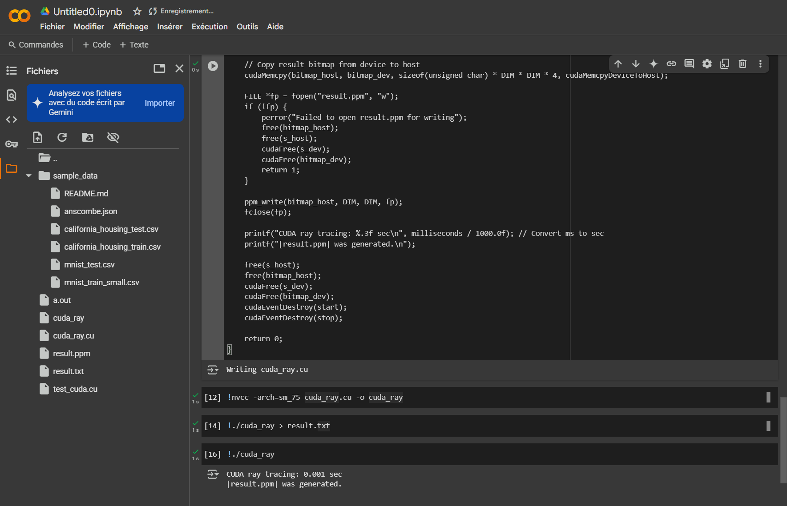
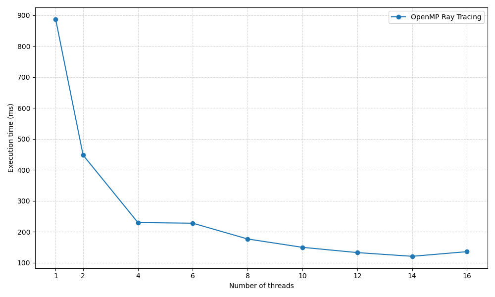
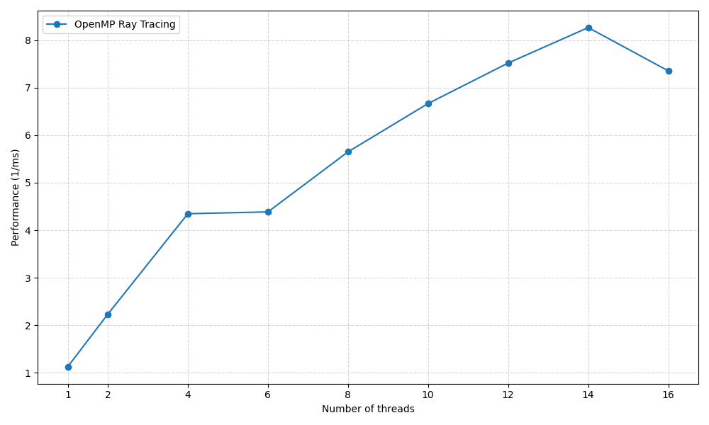

# Problem 1 Results

## Environment

### OpenMp

| CPU Type | CPU Model | Number of Cores | CPU Frequency | RAM Size | OS |
|----------|-----------|-----------------|---------------|----------|----|
| AMD Razen | AMD Ryzen 7 5800H | 8 | 3.2 GHz | 16 GB | Windows 11 -> WSL2 -> Ubuntu 24.04.2 |

### CUDA

All the CUDA code have been run with Google Colab.

## How to compile and run the code

### OPenMp

**1. Compilation:**

With makefile, you can compile the code with the following command:
```bash
$ make all
```

Without makefile, you can compile the code with the following command:
```bash
g++ -o openmp_ray openmp_ray.cpp -fopenmp -O0 -Wall -Wextra -Werror -pedantic -lm
```

**2. Execution:**

```bash
$ ./openmp_ray <number_of_threads>
```

### CUDA

**1. Compilation:**

The easier way to compile and run the CUDA code is to use Google Colab. You can find the code in the `cuda_ray.cu` file.

If you have a CUDA environment set up, you can compile the code with the following command:
```bash
nvcc -arch=sm_75 cuda_ray.cu -o cuda_ray
```

**2. Execution:**

```bash
$ ./cuda_ray
```

## Source code

`openmp_ray.cpp`:
```cpp
#include <stdio.h>
#include <string.h>
#include <stdlib.h>
#include <time.h>
#include <math.h>
#include <omp.h>

// Define constants for the ray tracing scene
#define SPHERES 20
#define rnd(x) (x * rand() / RAND_MAX) // Macro for generating a random float between 0 and x
#define INF 2e10f    // A large float value representing infinity (for depth comparison)
#define DIM 2048

// Structure to represent a sphere in 3D space
struct Sphere
{
    float r, b, g;
    float radius;
    float x, y, z;

    // Method to check if a ray (from the camera at z=0, looking down -z) hits this sphere
    // 'ox' and 'oy' are the ray's x and y coordinates on the image plane.
    // 'n' (normal) returns the normalized depth component, used for shading.
    float hit(float ox, float oy, float *n)
    {
        float dx = ox - x;
        float dy = oy - y;

        if (dx * dx + dy * dy < radius * radius)
        {
            float dz = sqrtf(radius * radius - dx * dx - dy * dy);
            *n = dz / sqrtf(radius * radius);
            return dz + z;
        }
        return -INF;
    }
};

// The core rendering kernel function, executed for each pixel
// 'x', 'y': current pixel coordinates
// 's': array of spheres in the scene
// 'ptr': pointer to the bitmap buffer where pixel color will be stored
void kernel(int x, int y, Sphere *s, unsigned char *ptr)
{
    int offset = x + y * DIM;
    float ox = (x - DIM / 2.0f);
    float oy = (y - DIM / 2.0f);

    float r = 0, g = 0, b = 0;
    float maxz = -INF;

    for (int i = 0; i < SPHERES; i++) {
        float n;
        float t = s[i].hit(ox, oy, &n);

        if (t > maxz) {
            float fscale = n;
            r = s[i].r * fscale;
            g = s[i].g * fscale;
            b = s[i].b * fscale;
            maxz = t;
        }
    }

    ptr[offset * 4 + 0] = (unsigned char)(r * 255);
    ptr[offset * 4 + 1] = (unsigned char)(g * 255);
    ptr[offset * 4 + 2] = (unsigned char)(b * 255);
    ptr[offset * 4 + 3] = 255;
}

// Function to write the bitmap data to a PPM image file
// 'bitmap': pointer to the pixel data
// 'xdim', 'ydim': dimensions of the image
// 'fp': file pointer to the output PPM file
void ppm_write(unsigned char *bitmap, int xdim, int ydim, FILE *fp)
{
    int i, x, y;
    fprintf(fp, "P3\n");
    fprintf(fp, "%d %d\n", xdim, ydim);
    fprintf(fp, "255\n");

    for (y = 0; y < ydim; y++) {
        for (x = 0; x < xdim; x++) {
            i = x + y * xdim;
            fprintf(fp, "%d %d %d ", bitmap[4 * i], bitmap[4 * i + 1], bitmap[4 * i + 2]);
        }
        fprintf(fp, "\n");
    }
}

int main(int argc, char *argv[])
{
    int no_threads;
    unsigned char *bitmap;
    double start_time, end_time;

    srand(time(NULL));

    if (argc != 2) {
        printf("Usage: %s [number of threads]\n", argv[0]);
        printf("Example: %s 8\n", argv[0]);
        exit(0);
    }

    no_threads = atoi(argv[1]);
    if (no_threads <= 0) {
        printf("Number of threads must be a positive integer.\n");
        exit(0);
    }
    omp_set_num_threads(no_threads); // Set the number of threads for OpenMP

    // Allocate memory for spheres on the host
    Sphere *temp_s = (Sphere *)malloc(sizeof(Sphere) * SPHERES);
    if (!temp_s) {
        perror("Failed to allocate memory for spheres");
        return 1;
    }

    // Initialize random spheres
    for (int i = 0; i < SPHERES; i++) {
        temp_s[i].r = rnd(1.0f);
        temp_s[i].g = rnd(1.0f);
        temp_s[i].b = rnd(1.0f);
        temp_s[i].x = rnd(2000.0f) - 1000;
        temp_s[i].y = rnd(2000.0f) - 1000;
        temp_s[i].z = rnd(2000.0f) - 1000;
        temp_s[i].radius = rnd(200.0f) + 40;
    }

    // Allocate memory for the bitmap (DIM x DIM x 4 bytes per pixel for RGBA)
    bitmap = (unsigned char *)malloc(sizeof(unsigned char) * DIM * DIM * 4);
    if (!bitmap) {
        perror("Failed to allocate memory for bitmap");
        free(temp_s);
        return 1;
    }

    start_time = omp_get_wtime(); // Record start time before computation

    // Parallelize the nested loops using OpenMP
    // 'collapse(2)' combines the two loops into a single iteration space for better load balancing
    #pragma omp parallel for collapse(2)
    for (int y = 0; y < DIM; y++) {
        for (int x = 0; x < DIM; x++) {
            kernel(x, y, temp_s, bitmap);
        }
    }

    end_time = omp_get_wtime(); // Record end time after computation

    FILE *fp = fopen("result.ppm", "w");
    if (!fp) {
        perror("Failed to open result.ppm for writing");
        free(bitmap);
        free(temp_s);
        return 1;
    }

    ppm_write(bitmap, DIM, DIM, fp);
    fclose(fp);

    printf("OpenMP (%d threads) ray tracing: %.3f sec\n", no_threads, end_time - start_time);
    printf("[result.ppm] was generated.\n");

    free(bitmap);
    free(temp_s);

    return 0;
}
```

`cuda_ray.cu`:
```cpp
#include <stdio.h>
#include <stdlib.h>
#include <time.h>
#include <math.h>
#include <cuda_runtime.h>

#define SPHERES 20
#define rnd(x) (x * rand() / RAND_MAX) // Macro for generating a random float between 0 and x
#define INF 2e10f    // A large float value representing infinity (for depth comparison)
#define DIM 2048

// Structure to represent a sphere in 3D space.
// This struct will be used for both host and device memory.
struct Sphere
{
    float r, b, g;
    float radius;
    float x, y, z;
};

// Device function to calculate if a ray hits a sphere.
// This function runs on the GPU.
// 'ox', 'oy': ray's x and y coordinates on the image plane.
// 's': pointer to the current sphere being tested.
// 'n': pointer to return the normalized depth component (normal).
__device__ float hit(float ox, float oy, const Sphere *s, float *n)
{
    float dx = ox - s->x;
    float dy = oy - s->y;

    if (dx * dx + dy * dy < s->radius * s->radius) {
        float dz = sqrtf(s->radius * s->radius - dx * dx - dy * dy);
        *n = dz / sqrtf(s->radius * s->radius);
        return dz + s->z;
    }
    return -INF;
}

// CUDA kernel function for ray tracing.
// This function is executed in parallel by multiple threads on the GPU.
// 's_dev': pointer to sphere data in device memory.
// 'bitmap_dev': pointer to image pixel data in device memory.
__global__ void rayTracingKernel(Sphere *s_dev, unsigned char *bitmap_dev)
{
    int x = blockIdx.x * blockDim.x + threadIdx.x;
    int y = blockIdx.y * blockDim.y + threadIdx.y;

    if (x < DIM && y < DIM)
    {
        int offset = x + y * DIM;
        float ox = (x - DIM / 2.0f);
        float oy = (y - DIM / 2.0f);

        float r = 0, g = 0, b = 0;
        float maxz = -INF;

        for (int i = 0; i < SPHERES; i++) {
            float n;
            float t = hit(ox, oy, &s_dev[i], &n);

            if (t > maxz) {
                float fscale = n;
                r = s_dev[i].r * fscale;
                g = s_dev[i].g * fscale;
                b = s_dev[i].b * fscale;
                maxz = t;
            }
        }

        bitmap_dev[offset * 4 + 0] = (unsigned char)(r * 255);
        bitmap_dev[offset * 4 + 1] = (unsigned char)(g * 255);
        bitmap_dev[offset * 4 + 2] = (unsigned char)(b * 255);
        bitmap_dev[offset * 4 + 3] = 255;
    }
}

// Function to write the bitmap data to a PPM image file (executed on host CPU)
// 'bitmap': pointer to the pixel data in host memory
// 'xdim', 'ydim': dimensions of the image
// 'fp': file pointer to the output PPM file
void ppm_write(unsigned char *bitmap, int xdim, int ydim, FILE *fp)
{
    int i, x, y;
    fprintf(fp, "P3\n");
    fprintf(fp, "%d %d\n", xdim, ydim);
    fprintf(fp, "255\n");

    for (y = 0; y < ydim; y++) {
        for (x = 0; x < xdim; x++) {
            i = x + y * xdim;
            fprintf(fp, "%d %d %d ", bitmap[4 * i], bitmap[4 * i + 1], bitmap[4 * i + 2]);
        }
        fprintf(fp, "\n");
    }
}

int main(int argc, char *argv[])
{
    Sphere *s_host;           // Pointer to sphere data in host (CPU) memory
    Sphere *s_dev;            // Pointer to sphere data in device (GPU) memory
    unsigned char *bitmap_host; // Pointer to image pixel data in host memory
    unsigned char *bitmap_dev;  // Pointer to image pixel data in device memory

    cudaEvent_t start, stop; // CUDA events for precise timing
    float milliseconds = 0;  // Variable to store elapsed time in milliseconds

    srand(time(NULL)); // Seed the random number generator

    // Allocate host memory for spheres
    s_host = (Sphere *)malloc(sizeof(Sphere) * SPHERES);
    if (!s_host) {
        perror("Failed to allocate host memory for spheres");
        return 1;
    }

    // Initialize random spheres data on the host
    for (int i = 0; i < SPHERES; i++) {
        s_host[i].r = rnd(1.0f);
        s_host[i].g = rnd(1.0f);
        s_host[i].b = rnd(1.0f);
        s_host[i].x = rnd(2000.0f) - 1000;
        s_host[i].y = rnd(2000.0f) - 1000;
        s_host[i].z = rnd(2000.0f) - 1000;
        s_host[i].radius = rnd(200.0f) + 40;
    }

    // Allocate equivalent memory on the device (GPU)
    cudaMalloc((void**)&s_dev, sizeof(Sphere) * SPHERES);
    cudaMalloc((void**)&bitmap_dev, sizeof(unsigned char) * DIM * DIM * 4);

    // Copy sphere data from host to device
    cudaMemcpy(s_dev, s_host, sizeof(Sphere) * SPHERES, cudaMemcpyHostToDevice);

    // Create CUDA events for timing kernel execution
    cudaEventCreate(&start);
    cudaEventCreate(&stop);

    // Define grid and block dimensions for the kernel launch.
    // Each block will have 16x16 threads.
    dim3 threadsPerBlock(16, 16);
    // Calculate the number of blocks needed to cover the entire DIM x DIM image.
    // (DIM + threadsPerBlock.x - 1) / threadsPerBlock.x ensures full coverage even if DIM is not a multiple.
    dim3 numBlocks( (DIM + threadsPerBlock.x - 1) / threadsPerBlock.x,
                    (DIM + threadsPerBlock.y - 1) / threadsPerBlock.y );

    cudaEventRecord(start); // Record start event before kernel launch

    // Launch the CUDA kernel on the GPU
    rayTracingKernel<<<numBlocks, threadsPerBlock>>>(s_dev, bitmap_dev);

    cudaEventRecord(stop);  // Record stop event after kernel completion
    cudaEventSynchronize(stop); // Wait for the GPU to finish all operations up to 'stop' event
    cudaEventElapsedTime(&milliseconds, start, stop); // Calculate elapsed time

    // Allocate host memory to receive the result bitmap from the device
    bitmap_host = (unsigned char *)malloc(sizeof(unsigned char) * DIM * DIM * 4);
    if (!bitmap_host) {
        perror("Failed to allocate host memory for bitmap");
        cudaFree(s_dev);
        cudaFree(bitmap_dev);
        free(s_host);
        return 1;
    }

    // Copy the rendered image data from device back to host memory
    cudaMemcpy(bitmap_host, bitmap_dev, sizeof(unsigned char) * DIM * DIM * 4, cudaMemcpyDeviceToHost);

    FILE *fp = fopen("result.ppm", "w");
    if (!fp) {
        perror("Failed to open result.ppm for writing");
        free(bitmap_host);
        free(s_host);
        cudaFree(s_dev);
        cudaFree(bitmap_dev);
        return 1;
    }

    ppm_write(bitmap_host, DIM, DIM, fp);
    fclose(fp);

    printf("CUDA ray tracing: %.3f sec\n", milliseconds / 1000.0f);
    printf("[result.ppm] was generated.\n");

    free(s_host);
    free(bitmap_host);
    cudaFree(s_dev);
    cudaFree(bitmap_dev);
    cudaEventDestroy(start);
    cudaEventDestroy(stop);

    return 0;
}
```

## Program output

### OpenMP

```bash
$ ./openmp_ray 8
OpenMP (8 threads) ray tracing: 0.182 sec
[result.ppm] was generated.
```

```bash
$ ./openmp_ray 3
OpenMP (3 threads) ray tracing: 0.322 sec
[result.ppm] was generated.
```


### CUDA




## Results

All the resuts diplay here are the average of 10 runs.

For better understanding on how the code tests are runs, please refer to the [`utils/report.go`](utils/report.go) file.

All the times are in milliseconds.

### Execution Time

| Benchmark Type | 1 | 2 | 4 | 6 | 8 | 10 | 12 | 14 | 16 |
|----------------|----|----|----|----|----|----|----|----|----|
| OpenMP Ray Tracing | 887 | 448 | 230 | 228 | 177 | 150 | 133 | 121 | 136 |



### Performance

| Benchmark Type | 1 | 2 | 4 | 6 | 8 | 10 | 12 | 14 | 16 |
|----------------|----|----|----|----|----|----|----|----|----|
| OpenMP Ray Tracing | 1.127 | 2.232 | 4.348 | 4.386 | 5.650 | 6.667 | 7.519 | 8.264 | 7.353 |



## Results Analysis

The performance of the OpenMP ray tracing implementation shows a clear trend of improvement as the number of threads increases, up to a certain point.
- Initial Speedup (1 to 14 threads): From 1 to 14 threads, we observe a significant reduction in execution time and a corresponding increase in performance.
  - Doubling threads from 1 to 2 halves the execution time (887ms to 448ms), indicating near-perfect linear speedup.
  - This trend generally continues up to 14 threads, where the execution time reaches its minimum of 121ms and performance peaks at 8.264 1/ms.
  - This is expected for a task like ray tracing, where each pixel's computation is largely independent, making it highly amenable to parallelization. OpenMP's collapse(2) clause effectively distributes the pixel-wise work across available threads.
 - Diminishing Returns (After 14 threads): Beyond 14 threads (specifically at 16 threads), the performance slightly degrades, with the execution time increasing from 121ms to 136ms and performance dropping from 8.264 1/ms to 7.353 1/ms.
  - Overhead: This slowdown is typically due to parallelization overhead. As more threads are introduced, the overhead associated with managing threads (creation, synchronization, scheduling, context switching) starts to outweigh the benefits of additional parallelism.
  - Core Saturation: Your AMD Ryzen 7 5800H has 8 physical cores. While it might have 16 logical threads (due to SMT/Hyper-threading), the performance often starts to plateau or decline when the number of software threads exceeds the number of physical cores. Beyond 8 cores, additional threads might be competing for the same physical resources, leading to contention and less efficient utilization. The optimal performance at 14 threads suggests that using slightly more threads than physical cores might sometimes be beneficial due to slight imbalances or scheduling nuances, but pushing it too far leads to diminishing returns or even degradation.
 - Comparison to CUDA (Qualitative): Although direct numerical comparison isn't presented in the tables for CUDA, the example CUDA output (0.001 sec) suggests that the GPU implementation is significantly faster than the OpenMP CPU implementation, even at its peak (0.121 sec at 14 threads). This is generally expected due to the massive parallelism (thousands of cores) available on GPUs, which are highly optimized for data-parallel tasks like ray tracing where the same operation is applied to many data points simultaneously.

In summary, the OpenMP implementation demonstrates effective parallelization on the CPU, achieving good speedup as threads are added, but eventually hitting a point of diminishing returns due to the overhead of thread management and hardware limitations.

## Tools

### Benchmarking

The benchmarking was done using a go script that runs the code 10 times and takes the average of the results. The script get the execution time by parsing the stdout of the C programme.

### Data Visualization

The data visualization is done using the Python libraries `matplotlib` to generate the graphs. The tables are generated using simple markdown tables.
The graphs are saved in the `media` directory, and the tables are included in this markdown file.

The script will read the `results.json` file generated by the go script and generate the graphs and tables based on the data in the file.

To generate the graphs and tables, run the following command:
```bash
python3 gen_report.py
```
This will display the table in the standart output and sage the png of the graph in the `media` directory.
